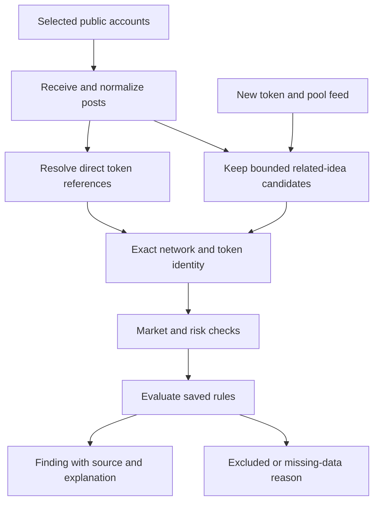

# Soltech scanner builder: research and recommended direction

Research date: September 28, 2026. This is a decision brief, not an implemented redesign. The running app and saved user data were left unchanged during this research.

## The decision

Replace the current general-purpose filter form with a short setup that starts with the user's intention:

**Choose a purpose → set up → preview and save.**

There are four decisions inside those three screens: the starting point, the sources, what counts as a match, and the final review. Keep sources and matching together on Set up, because they depend on each other.

For an X scanner, a beginner should be able to say: “Watch these accounts. Find coins they mention. Optionally show possible connections to their ideas. Explain each match.” Market filters can refine that request after the person understands it.

Your broader idea—finding coins connected to a public figure's posts—is worth retaining. The difficult part is establishing the connection. A matching word, image, ticker, or project-supplied X link is not evidence that the public figure created or endorsed the coin. Soltech should make the relationship inspectable instead of hiding this uncertainty behind a confident summary.

I recommend designing the guided flow next, then implementing one trustworthy end-to-end X scanner with direct references before treating theme matching as production-ready. Related ideas should remain part of the design and enter as a clearly labeled experimental option once evaluated.

## What is wrong today: observed versus inferred

The following were established by inspecting the current source and focused checks. These are not observations from a user study:

| Observed behavior | Why it matters |
|---|---|
| Create opens a named draft with New projects selected; the X path is labeled Public figures. | The user's first task is finding the right kind of scanner, but the interface has already chosen another kind. |
| The editor begins with a name, then a large set of settings grouped into disclosures. | The most important decision—what should cause a result—is not the organizing idea. |
| X accounts are free text. An empty list can be saved into Active. Commas alone also pass validation. | A scanner can appear configured even when it has no usable source. Saving an incomplete draft should be allowed; activating an incomplete scanner should not. |
| Related themes are included by default, without a working matching engine. | A difficult, uncertain behavior looks as straightforward as a numeric filter. |
| Sample results change by scanner family, not by the actual account list or market rules. | The user cannot learn whether their choices did anything. The existing sample labels help honesty, but do not provide a useful rule preview. |
| The checker supports eight networks; scanner settings have no network field and include Solana-specific venues and token controls. | The checker and builder can imply different coverage. Each scanner needs an explicit, truthful network scope. |
| Draft recovery, saved scanners, validation messages, and deactivation already exist. | Preserve this work. The improvement is the order of decisions and the connection to results. |

The usability hypothesis is that a source-first flow with a meaningful preview will reduce confusion. Your feedback supports investigating that hypothesis; it does not establish the best number of screens or the correct defaults for everyone. Detailed code evidence is in the companion current-implementation audit.

## What existing products teach us

| Reference inspected | Useful pattern | Soltech translation |
|---|---|---|
| GMGN's first-party X Tracker documentation | Account selection, post-type choices, and a contract-address-only view are explicit. | Make “who to watch” and “what counts” separate choices. Keep the evidence link with each result. |
| Zapier's documented editor flow | A trigger is configured and tested using records before publishing. | Show an actual example of a rule passing or failing before asking the user to trust a scanner. |
| IFTTT's documented creation flow | A small sequence connects an event to an outcome. | Describe a scanner as “When this appears, show me this,” rather than starting with a technical filter inventory. |
| Apple onboarding and disclosure guidance | Teach at the relevant action, postpone nonessential setup, and reveal advanced detail when needed. | A short explanation beside an account or filter is more useful than a tutorial page or a long introductory paragraph. |

These are patterns, not proof that copying their layouts will work for Soltech. GMGN's trading actions and speed claims are not suitable measures of a beginner research tool. Axiom's inspected documentation contains ambiguity about customization; the comparison report calls that out rather than treating it as verified behavior. No competitor's private implementation or actual alert latency was inspected.

Sources: [GMGN X Tracker](https://docs.gmgn.ai/index/x-tracker), [Apple onboarding](https://developer.apple.com/design/human-interface-guidelines/onboarding), [Apple disclosure controls](https://developer.apple.com/design/human-interface-guidelines/disclosure-controls). The UX companion report includes the exact Zapier and IFTTT sources and inspection limits.

## The proposed mobile experience

Use three progress labels: **Purpose · Set up · Review**. The four decisions below describe the content; decisions 2 and 3 share the Set up screen. Optional filters open from that screen without becoming mandatory steps.

### 1. What do you want to find?

Two clear starting cards:

- **Posts on X** — “Find coins connected to accounts you follow.”
- **New coins** — “Find recently launched coins.”

Both start from editable templates. Do not make “All coins” a third beginner path yet: it combines two different discovery systems without explaining the difference. An advanced market scanner can be added when its discovery source and use case are defined.

Give the draft an automatic descriptive name, editable on the final screen. Naming should not interrupt learning the task. This changes the creation flow, not the existing Public figure scanner's identity or approved artwork.

### 2. Who should it watch? — X branch

Search or paste an X handle/profile link. Resolve it to an account and show its display name, handle, avatar, and a link for verification. Tapping Add creates a removable account chip. Use a stable account ID internally so a renamed handle does not silently change the source.

There should be no requirement to connect the user's personal X account simply to watch public accounts. That is separate from a future “import who I follow” feature. X's current Activity quickstart documents public-event access with an app bearer token; the target public account does not need to sign into Soltech for that model. Actual app entitlement still needs to be tested. [X Activity quickstart](https://docs.x.com/x-api/activity/quickstart)

Do not preselect politicians, celebrities, or trading accounts without a deliberate user choice. A curated starter collection could come later, with ownership and maintenance. A typed but unresolved handle stays a draft value. If lookup fails, preserve the text and say what could not be checked.

For the **New coins** branch, this screen instead chooses launch stage and supported networks. Start with plain choices such as “On a launchpad” and “Already trading.” Explain graduation only when relevant. A new pool is not automatically a new token.

### 3. What should count as a match?

For X, keep two concepts distinct:

| Choice | Meaning | Result label |
|---|---|---|
| **Coin mentions** | An address or supported token/pool link can be resolved to an exact network and token. A ticker alone needs disambiguation. | Address/link match |
| **Related ideas** | Words or themes from a post may relate to a coin, even without an explicit token reference. | Possible connection |

Both options may be enabled, but direct references are the recommended first live release. Related ideas should never silently upgrade to a verified relationship. Confidence that two things are related and the token's risk assessment are different dimensions; do not merge them into one score or green badge.

Default to original posts and quotes, with quotes clearly attributed. Replies and reposts belong under More options. Reposts should not inflate the count of independent evidence. The precise starting defaults are proposals to test, not demonstrated trading advantages.

Keep a short “Refine results” entry here. It opens a small set of relevant filters, with an “Any” state. The user should be able to finish without choosing arbitrary financial thresholds.

### 4. Preview your scanner

Show a compact sentence generated from the actual rules, not from marketing copy. Example wording, using a fictional account:

> Watch @example's posts and quotes for coin addresses or links. Hide high-risk matches. No market limits.

Then show a **source → token → reason** example. For a real test, include the tested time window, the original post link, the exact token identity, the rule that matched, exclusions, and source gaps. A recent-history test demonstrates mechanics, not profitability or comprehensive coverage.

Until X ingestion and matching exist, label examples “Example” and explicitly distinguish them from the user's configured results. Do not calculate fictional pass counts or show the same sample coins as if the new filters had been applied.

Final actions should reflect capability: **Save draft** in an unconnected prototype; **Start scanner** only when source access and execution actually work. Existing drafts remain accessible from Profile. In a live service, returning to Active should show its real starting/active/paused/error status and last successful check, not sample findings counted as new activity.

This three-screen flow is a design proposal. Experienced users should be able to edit a section directly; a reusable scanner should not require repeating setup every time.

## Which settings belong where?

| Placement | Controls | Reason |
|---|---|---|
| Required for an X scanner | Accounts; matching mode; supported network scope | Defines what it actually watches and finds. |
| Required for a new-coin scanner | Launch stage; supported network scope | Determines the discovery source and valid metrics. |
| Easy optional refinements | Coin age; market-cap range; minimum DEX liquidity when applicable; recent activity; risk visibility | Familiar constraints with clear units and visible effects. Keep defaults unrestricted until tested. |
| Advanced | Replies/reposts, words to include/exclude, time windows, holder concentration, creator holdings, token controls, venue, price-change ranges | Useful when the user has a specific reason, but unnecessary to understand the basic task. |
| Not a beginner configuration choice | AI model, confidence weights, RPC provider, polling interval, API keys, retry settings | Soltech should own and validate these operational decisions. |
| Defer until defined and tested | Numeric “safe” presets, auto-buy, automatic claims of endorsement, arbitrary insider/bundle thresholds | These add confidence or financial consequences that the evidence does not justify. |

Every applied numeric rule needs a **pass / fail / missing** result. If liquidity is required and unavailable, the coin has not passed the rule. Missing risk data should remain gray and explicit; high-risk results can stay in Excluded as already agreed. Unknowns must not be quietly described as good coins.

Use AND between rule groups and OR among selected choices in one group. State that in plain language where a preview explains a mismatch. A token should not be excluded by a hidden setting from another scanner type. Preserve inactive settings in the draft if useful, but show only the ones that actually apply.

## What must exist behind a credible X scanner

This architecture is a recommendation for Soltech, not a claim about a competitor's private code.

1. **Ingest once, distribute by rule.** Many users may watch the same public account. Receive the event centrally and evaluate applicable scanners instead of creating one independent polling loop per user. Save event IDs, versions, authorship, reference type, and timestamps. Keep credentials server-side.
2. **Resolve identity before scoring.** Use network plus mint/contract address as the token key. Resolve known pool links through a provider; a pool address is not the token mint. Preserve multiple candidates when a ticker is ambiguous. Solana identifies a token by its mint account, not its name or image. [Solana token documentation](https://solana.com/docs/tokens)
3. **Watch for coins that arrive later.** A post may inspire a coin created minutes or hours afterward. Related-idea monitoring therefore needs a bounded lifetime and a token-discovery feed. It should track pending, matched, expired, and unavailable states rather than concluding “nothing exists” after one search. Choose the lifetime from observed cases and cost measurements.
4. **Separate deterministic matching from interpretation.** Parse addresses and recognized links first. An optional language model can propose themes and concise explanations, but it must not invent a contract, source quote, relationship, or safety result. Treat posts as untrusted input and validate all structured output.
5. **Enrich and evaluate.** Reuse the checker where possible, but give each metric a provider, observation/retrieval time, network, pool scope, and missing-data state. A paid DEX profile or boost is promotional information, not a security pass.
6. **Deduplicate and recover.** One coin found through several posts should retain several evidence links rather than multiplying the new-find count. Retries and reconnects must not resend identical alerts. Post edits/deletions need corresponding handling, with retention/display behavior reviewed against provider terms before launch.
7. **Run when the phone is closed.** A live scanner needs a persistent service, durable rules, background processing and delivery state. Browser storage and an open tab are sufficient for the current prototype, not for an always-on app. Show outages distinctly from zero matches.

X's public Activity API is a promising source-specific option; Filtered Stream offers more complex post filtering. These are source capabilities, not connected Soltech functionality. We did not authenticate an X app, buy access, or verify production latency. X's own billing pages disagree about deletion-event charging, so exact entitlement and charges need confirmation in the developer console before implementation. [Activity documentation](https://docs.x.com/x-api/activity/introduction), [pricing](https://docs.x.com/x-api/getting-started/pricing)

## Data coverage that affects the design

- **DEX Screener:** Useful token/pair search and enrichment, with explicit token and pool identifiers. Automatic listing follows a liquidity pool and a transaction, so it cannot be assumed to provide every pre-trading idea or launch. Its listed-profile/boost feeds are not a complete launch census. [API reference](https://docs.dexscreener.com/api/reference), [listing rules](https://docs.dexscreener.com/token-listing)
- **Birdeye:** Its official engineering guide describes new-listing/new-pair subscriptions, recovery via REST and later enrichment. WebSocket availability is plan-dependent. This is a concrete candidate for a new-coin feed, not proof that every venue or launch stage is covered. [Data-layer guide](https://birdeye.so/data-api/blog/detail/solana-trading-bot-api-data-layer-birdeye)
- **CoinGecko/GeckoTerminal:** Its pool filter reference documents missing/unverified market cap and distinguishes unknown checks; the inspected honeypot field is not supported for Solana. Do not expose a universal “honeypot passed” control based on that source. [Megafilter reference](https://docs.coingecko.com/reference/pools-megafilter)
- **Solana Tracker and existing risk sources:** The current checker integration does not establish rights or coverage for a continuous, multi-user discovery service. Confirm relevant endpoints, limits, caching and redistribution terms separately. One working bundle lookup does not answer those questions.

Prefer a small, declared network/venue scope for the first live scanner over an “all coins everywhere” promise. The manual checker can keep its broader coverage. The builder should display available scope without forcing beginners to understand infrastructure.

## Accuracy, cost and latency: what to measure

“Extremely accurate” should become specific acceptance checks:

- **Identity precision:** Is the displayed token exactly the token supported by the evidence? Keep chain/address collisions and ambiguous tickers in the test set.
- **Relationship precision:** Does a result say direct mention, quoted content, or possible theme accurately? Measure false asserted connections separately from missed possibilities.
- **Discovery recall:** Within a declared feed, interval and labeled reference set, how many eligible tokens are missed? We cannot measure all possible coins from a search endpoint alone.
- **Delivery reliability:** Track post time, ingestion time, enrichment completion and user delivery. Report median and slower-tail latency from real tests rather than promising instant results.
- **Filter correctness:** Each rule returns pass, fail, missing or unsupported. A provider outage cannot turn an unknown into green.
- **Cost:** Measure unique events ingested, candidate lookups, enrichments, optional model work and notification fan-out. Shared ingestion can reduce duplication, but provider billing and entitlements still control actual spend.

Build a labeled test set containing an exact address, a pool link, duplicated ticker, unrelated namesake, quote/repost, sarcastic mention, impersonation account, deleted/edited post, late token launch, missing market cap, concentrated holders, feed outage and duplicate delivery. For interpreted cases, use two reviewers and record disagreement. Run in a limited pilot without user alerts before exposing it as live.

## What I would do next, in order

1. Review this proposed flow together. Keep the approved overall theme and scanner artwork.
2. Design the three mobile screens, with direct links back to edit each choice. Put unfamiliar terminology beside the relevant control.
3. Fix the known empty-account and delimiter-only validation gaps. Preserve incomplete drafts but prevent them from appearing as live scanners.
4. Add an honest preview contract and explicit network scope. Keep example and live results visibly different.
5. Build and test one real direct-reference X path with a small set of accounts, using the existing coin report as the destination.
6. Evaluate related-theme matching separately, including tokens launched after the post. Expand only when users understand the difference and measured false links are acceptable.

For the first usability round, ask 5–8 adult beginners to create a scanner for two named accounts, explain what will and will not match, narrow a result set, recover a draft, and distinguish a possible connection from an endorsement. Observe hesitation and errors without coaching. This small formative test finds issues; it cannot establish population-wide success or financial benefit.

## Research scope and remaining uncertainty

The work reviewed current Soltech source, reproducible local behavior, first-party scanner/automation documentation, provider specifications and design guidance. It did not inspect competitors' authenticated dashboards, benchmark live X delivery, test paid subscriptions, build a matching model, or interview users. Provider access, inference quality, appropriate thresholds, and the best step count remain unverified.

Companion reports:

- [Current implementation audit](scanner-builder-current-audit-2026-09-28.md)
- [X data and matching research](x-scanner-source-research-2026-09-28.md)
- [Builder UX comparison](scanner-builder-ux-research-2026-09-28.md)
